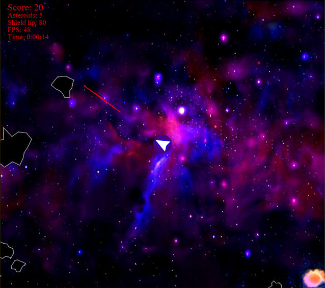

  

[**Play the game!**](https://py2.codeskulptor.org/#user48_uxUdEXOYYl_104.py)

The last project in my [Coursera Python class](https://www.coursera.org/learn/interactive-python-2?specialization=computer-fundamentals) is the game Asteroids. If you are unfamiliar with Asteroids, the goal is to shoot and dodge asteroids from your spaceship. It is a 2-D game where the screen shows the same area of space, but the objects on the screen can fly into one edge of the screen and come out the opposite edge.

This is my first attempt at a physics based game. I had a lot of fun with this one. The game gets progressively harder. The number and speed of asteroids increases over time.

## Likes

### Random asteroid shapes

The Python class suggested using an animated sprite for asteroids, but I wanted to be more true to the original and use randomly generated polygons. The polygons are generated by choosing a random number of vertices and random distances from each vertex to the polygon's center.

### Asteroid fragmentation

Asteroids that are large enough will fragment upon collision.
The velocity vector of the fragmented asteroids is based on the the velocity vector of the original asteroid.

### Boss asteroid

-   There is a two percent change that any new asteroid will be a boss asteroid. Boss asteroids are very large, hard to destroy, and do not take damage when hitting regular asteroids.
-   Boss asteroids show multiple explosion animations on random parts of the asteroid.

### Power ups

-   Power ups increase your weapon capabilities or shield HP.
-   Power ups can only be obtained by flying the ship into them.
-   If a power up is not obtained within 7 seconds, it disappears. A power up will start flashing before it disappears.

### Explosion animations

-   The explosion animations are a few different pre-rendered image files provided through the Coursera class. [Here is an example](http://commondatastorage.googleapis.com/codeskulptor-assets/lathrop/explosion_alpha.png).
-   Explosion animations keep the velocity of the asteroid.
