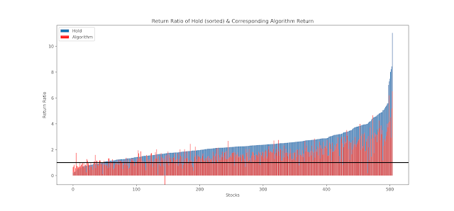
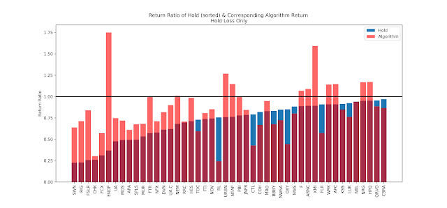

Sometimes I wonder if or when I should buy a stock, and I'll get a stock trading algorithm in my head. Would it beat holding the stock? How risky is it?

One way to access that is testing the algorithm on past market data. Here, I do just that.

[Stock Market Analysis](https://nbviewer.jupyter.org/github/hydrospanner/stock-crossover-trading/blob/master/Stocks%20Market%20Analysis.ipynb)

- Use API to pull stock data
- Methods to analyze stock data
- [Crossover trading](https://www.investopedia.com/terms/c/crossover.asp)
- Backtest crossover trading strategy

  

While this Notebook follows another blog post, I made significant changes to the code and added better visualizations.

[Stock Trading Algorithm Testing](https://nbviewer.jupyter.org/github/hydrospanner/stock-crossover-trading/blob/master/Stock%20Trading%20Algorithm%20Testing.ipynb)

- Test the Crossover trading algorithm on all the stocks in the S&P 500
- Analyze results 

  

  

Crossover algorithm often exceeding hold when hold results in loss.

[GitHub for this project](https://github.com/hydrospanner/stock-crossover-trading)

Disclaimer: This is in no way financial advice. I am not a financial adviser.  This post and code were done as a data analysis exercise only.

