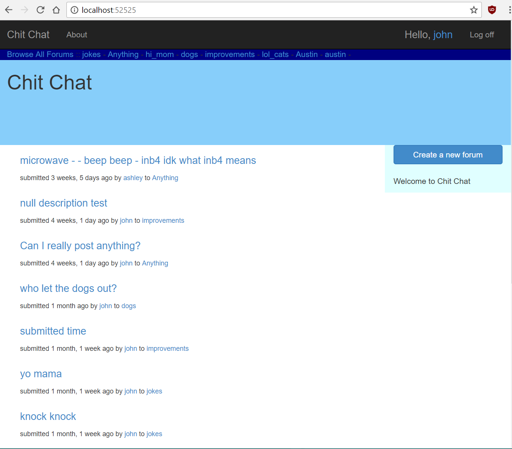
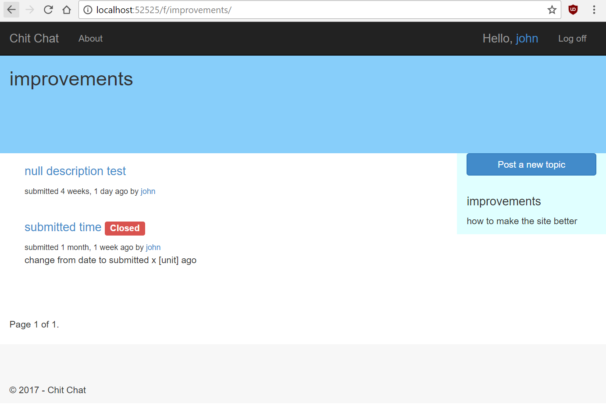
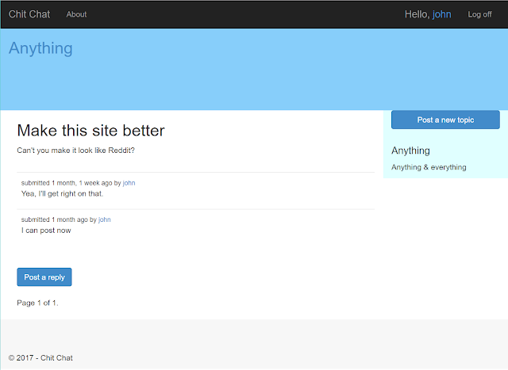

I made my first web application!

It's a forum website. Think, [Reddit](https://reddit.com), or a site where people post and comment on things. I chose a forum, because some of my ideas down the road involve a website where users collaborate.

I built the project using Django, a Python web framework. Django allows for fast development and is built using a "don't repeat yourself" philosophy which minimizes redundant code.

After going through the official Django tutorial and poking around, I wanted to make something by myself.

## Let's see it

[Here's the Github repository](https://github.com/hydrospanner/DForurm).
To run it locally, install it and run

```shell
python manage.py runserver
```

If you don't want to do that, I do have a few screenshots.

### Index Page

<div className="Image__Medium">
  
</div>

The index page will look familiar to a reddit user. The eye grabbing content is the title of each post. In smaller text is when the post was submitted, who posted it, and where they posted it.
In the dark blue header, is a quick link to some of the website's forums. A list of all the website's forums is also available.

### Forum page

<div className="Image__Medium">
  
</div>

Each Forum's page lists the forum's topics sorted to show the most recent. The forum's description is in the sidebar. The URL to get to a forum's page is really easy to read. It's just `/f/[forum_name]`.

### Topic page

<div className="Image__Medium">
  
</div>

Each topic's page contains the topic's body, followed by posts from other users. The topic page inherits the sidebar from its forum.

## Final Thoughts

I used Visual Studio 2017 (VS) as my IDE. I never used VS for development before, but I found it very useful for web development. I'll definitely use it again for my next Django project.

I was happy that the front end web development class I took didn't go to waste. Bootstrap really adds a lot.
