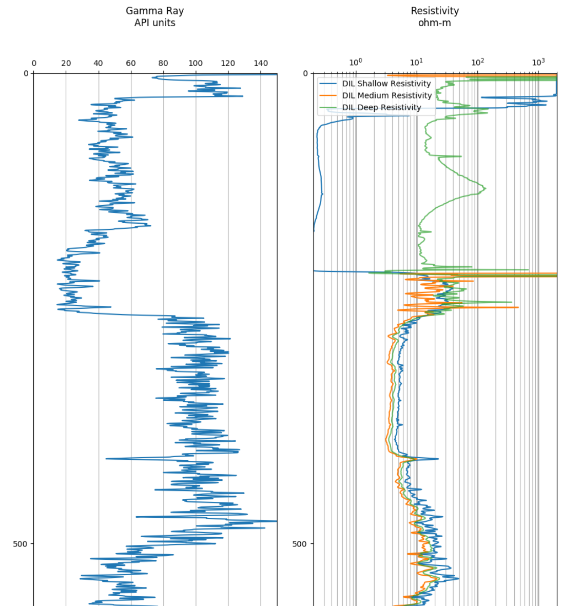

A well log is a measurement with respect to depth or time of various physical characteristics in or around a well bore. Well logs are used extensively by the oil and gas industry. The universal digital format of well logs is the Log ASCII Standard (LAS).

Reading and interpreting well logs has been a common task for me both in college and at work. I have a project in mind for an app to store, view, interpret, and share well logs in a web app, so I want to be more familiar with the file format.

[This Notebook](https://github.com/hydrospanner/lasio-test/blob/master/lasio%20test.ipynb) is my first attempt at working with well logs using Python. I'm using [lasio](https://github.com/kinverarity1/lasio) as my LAS parser.

My goals with the project were to

-   Test if lasio works consistently with hundreds of well log files.
-   Analyze the usage frequency of well logging tools and how standardized the syntax is between well logging tools in terms of how the tools are named and described.
-   Plot some of the gamma ray, resistivity logs.

No test of a LAS parser would be complete without plotting the log data. Images of plotted well logs are quite large. It's common to have more than one data point per foot depth for each tool and a well can be many thousands of feet deep. Below is a cropped example of a plotted well log. Full logs can be found in this [project's source](https://github.com/hydrospanner/lasio-test/tree/master/image%20out).

  

