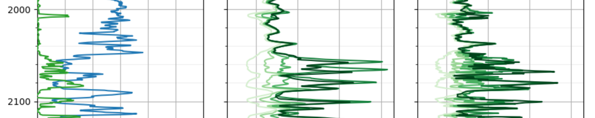

I've been working on a website for working with well logs on and off for a while now.

Meet [Loggie](https://well-loggie.herokuapp.com/), a well log website!

With Loggie, you can join and create groups to share your logs, and customize how public or private each group is. It's similar to Reddit's permission system with well logs instead of posts.

Well logs are a collection of sensors lowered into a well bore. The variety of sensors, scale of the data, and visualization options create an interesting challenge for displaying the data.

At the moment the visualizations are based on a mapping I created of common logging tools and how they're plotted. An enhancement to that would be to allow users to customize the visualization, plotting tools Loggie doesn't recognize.

All the code I've written for Loggie is closed source at the moment, but I'm thinking I'll open source the Permission system app at least.

Here's a screenshot from an array induction log:

  

You can view this log on Loggie, [here](https://well-loggie.herokuapp.com/g/public/log/11).
