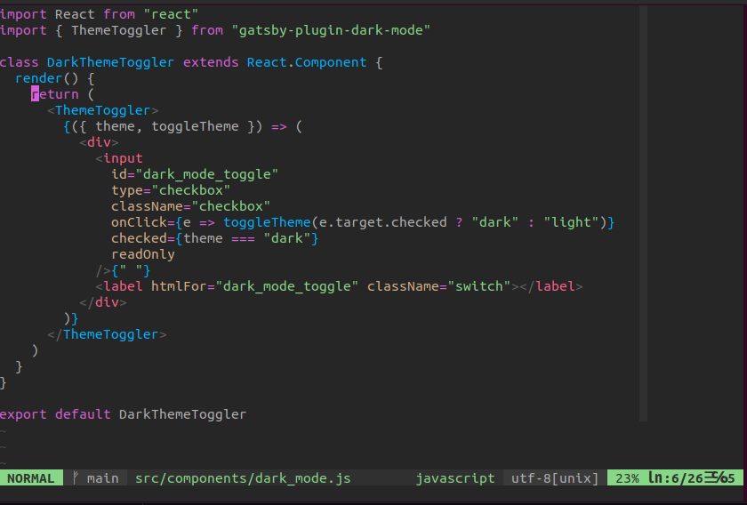

I've used Vim as my main text editor since 2019.
I love having my entire workflow in the terminal.
Vim is highly configurable, I feel like I have full control of its UI, and behavior.

Here's a screenshot from my Vim setup showing a React component from this blog:

<div className="Image__Medium">
  
</div>

## Version controlling my Vim Config

A few months ago, I started version controlling [my Vim settings](https://github.com/hydrospanner/dotvim) and plugins.
Adding version control allows me to experiment without worrying I'll break anything.
I became more comfortable tinkering with it and saw an improvement in my productivity.

If I'm having a problem with my settings, I can ask the Vim community and link to my Vim settings on GitHub.

## Easy syncing between machines

I have a couple machines and virtual machines where I use Vim.
So I have the need to sync Vim plugins and settings between machines.

By version controlling everything, I can setup a new machine with

```shell
cd
git clone https://github.com/hydrospanner/dotvim.git .vim
echo "runtime vimrc" > .vimrc
```

When Vim is opened, [Plug](https://github.com/junegunn/vim-plug), a Plugin manager
included in my dotvim repo,
will automatically install any missing plugins.

## Pathogen vs Plug

Initially, I used [Pathogen](https://github.com/tpope/vim-pathogen) for Plugin management.
It works by picking up plugins from repos cloned to `~/.vim/bundle/`.
It works great in a single machine, but syncing those plugins gets interesting.
To track those Plugins in my dotvim repo, I could add those plugin repos as
[git submodules](https://git-scm.com/book/en/v2/Git-Tools-Submodules), and pull in changes with:

```shell
git pull
git submodule init
git submodule update
```

However, installing and updating vim packages in this way is really something Plug is designed for.
Instead of tracking the plugins in a `.gitmodules` file, Plug allows me to list them in the `vimrc` config.

```vim
call plug#begin()
Plug 'tpope/vim-sensible'
call plug#end()
```

## Neovim

I've also been using [Neovim](https://neovim.io/) lately.
There is a [GitHub CoPilot plugin](https://github.com/github/copilot.vim) available for Neovim that's not (yet) compatible with Vim.

Neovim has [documentation](https://neovim.io/doc/user/nvim.html#nvim-from-vim)
on extending Vim's config for Neovim.
Adding this to Neovim's `init.vim` config file gives me all my Vim configurations in Neovim.

```vim
set runtimepath^=~/.vim runtimepath+=~/.vim/after
let &packpath = &runtimepath
source ~/.vimrc
```

Then add Neovim specific configuration below that.

```vim
call plug#begin()
Plug 'github/copilot.vim'
call plug#end()
```

Note that the Plugs in the Vim config have to be installed from Vim, not Neovim.
