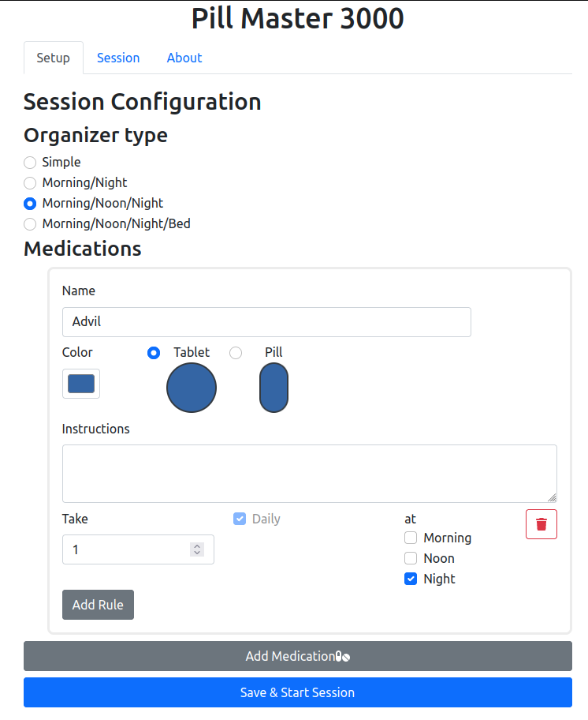
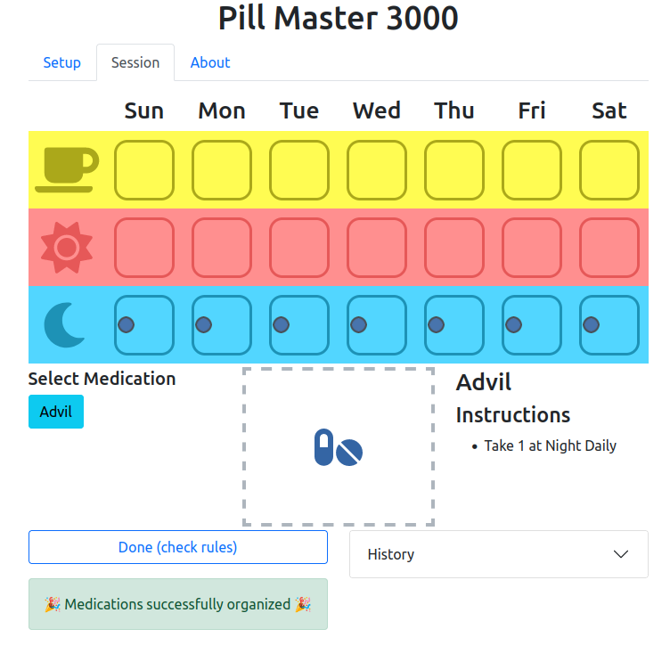

The idea for this project came from my wife, who explained an idea for a cognative therapy
exercise with a patient on an iPad.

This app is a tool for a therapist and patient to practice organizing medications using a pill organizer.

The therapist will setup the patient's medications, then hand off the app to the paitent to drag the pills into the organizer.

The UI allows for multiple medications with different rules for how many and when the medications should be taken. Pill color and type (e.g., tablet, pill) can also be set.

  

The patient will drag pills from the bottom box into the organizer. Once done, the paitent will see if they met the rules.

  

See the project [here](https://hydrospanner.github.io/pill-organizer/).

The project is Open Source and available [here](https://github.com/hydrospanner/pill-organizer).
